# 🛫 HAST (Have A Safe Trip) 🛫

 

## 💬 주제

- 세계의 잠재적인 안전 위험을 식별하고 여행자를 위한 안전 예방 서비스 제공

## 📅 기간

- 2023.02.27 ~ 2023.04.07

## 💥 목적 및 핵심내용

- 단순히 나라별 치안 정보가 아닌 수시로 업데이트 되는 실제 데이터에 기반한 정보를 제공함으로써 **안전한 여행을 위한 서비스**를 제공

## 😊 참여 인원 및 역할

| 이름   | 역할          |
| ------ | ------------- | --- |
| 강민정 | Back-End      |
| 권성현 | Front-End     |
| 배충현 | Data          |
| 성정언 | Front-End     |
| 장미림 | Front-End     |
| 정원웅 | Data & Server | \   |

## 💎 목차

1. [**프로젝트 컨셉 및 주요 기능**](#1)
1. [**개발 환경 및 문서**](#2)
1. [**시연 시나리오**](#3)
1. [**HAST UCC**](#4)

 

# 👀 프로젝트 컨셉 및 주요 기능

## 의도

- 여행을 떠나는 사람들에게 해당 지역의 사건 및 뉴스를 가능한 빨리 접할 수 있게 한다.
- 비상상황 발생시 이용할 수 있는 주변 기관 위치 정보를 제공한다.

## 예상 사용자

- 혼자 여행할 수 있는 수준의 안전한 도시를 찾는 여행자
- 현재 여행하는 곳의 치안 확인하고 싶은 여행자
- 주변 공공 기관 정보를 알고 싶은 위험에 처한 여행자

## 주요 기능

- 실시간으로 일어나는 치안에 관련된 전세계의 사건들을 보여줌
- 지역별 병원, 대사관, 경찰서 등 장소 제공
- 영어/한국어 두가지 언어 지원
- 3D 지구본을 활용한 게임 제공

## 세부 기능 설명

- 실시간으로 일어나는 전세계의 사건들을 보여줌
  - three.js를 활용해 지구본 시각화
  - 15분마다 업데이트 되는 기사 데이터
  - 나라별 치안 통계 시각화 데이터 제공
  - 반응형 레이아웃 지원
- 지역별 병원, 대사관, 경찰서 등 장소 제공
  - 원하는 위치 주변의 장소들 제공
- 영어/한국어 두가지 언어 지원
  - 영어와 한국어 버전 모두 지원
- 3D 지구본을 활용한 게임 제공
  - 수도 맞추기 게임
  - 국기 맞추기 게임

## 기대효과

- 수시로 일어나고 있는 사건을 알고 예방함으로써 보다 안전한 여행이 될 수 있다.
- 위급상황 발생시 주변 관련 공공기관을 찾아 더욱 빠르게 대처할 수 있다.
- 단순한 데이터 나열보다 다양한 시각화를 제공해 한눈에 띄게 볼 수 있다.

 

# 📜 개발 환경 및 문서

## 기술스택

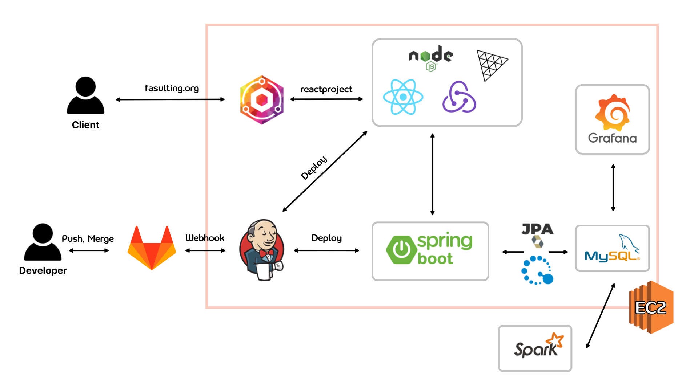

## 개발환경

## Entity Relationship Diagram

[ERD](./etc/docs/ERD.md)

## Gantt chart

[간트차트](./etc/docs/gant.md)

## 포팅메뉴얼

[포팅메뉴얼](./etc/docs/포팅메뉴얼.md)

 

# 💫 시연 시나리오

## 1️⃣ Web 화면

 

### 🌍 메인화면

- 회전하는 지구본으로 177개국 국가 확인 가능
  
   

- 우측 상단 열쇠 아이콘 클릭 시 FAQ 보여줌
  
   

- 지구본 내 국가 클릭 시, 사이드 바 내 국가 정보 표시
  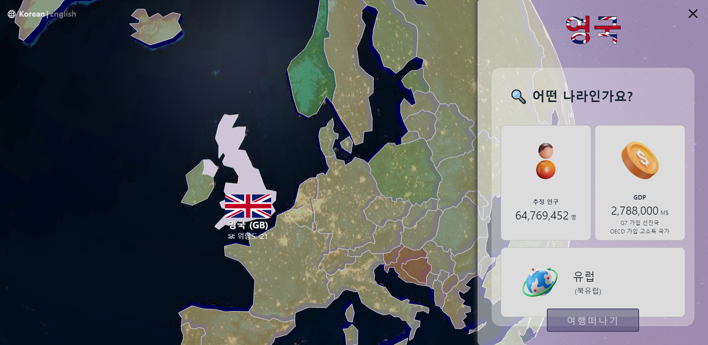
   
- 좌측 상단 영어, 한국어 언어 선택 가능
  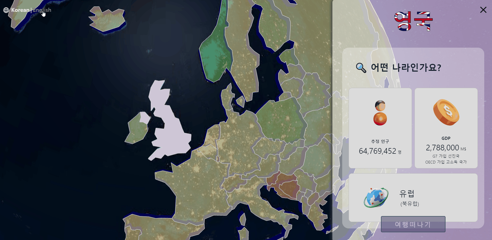
   
- 사이드 바 스크롤하여 통계 데이터 시각화 그래프 3가지 확인 가능
  
   
- 로딩 페이지
  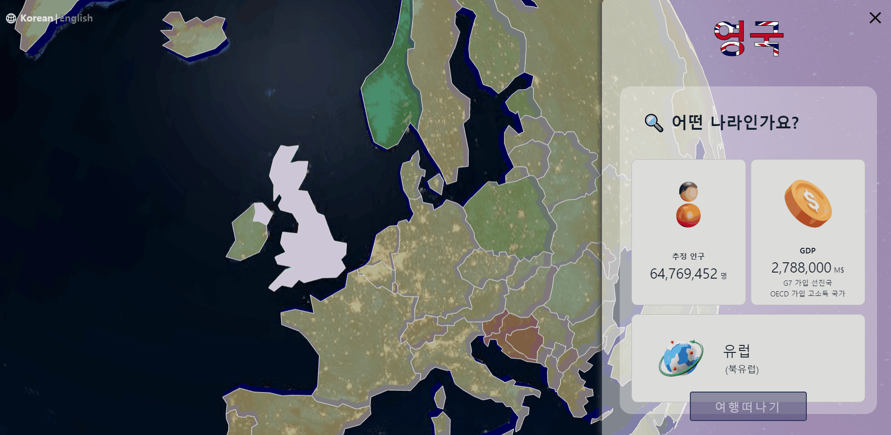
   

### 🎮게임 페이지

→ 메인 페이지 내 우측 상단 카드 아이콘 클릭 시 게임 페이지로 이동
 

- 게임 메인 페이지
  
   
- 국기 맞추기 게임
  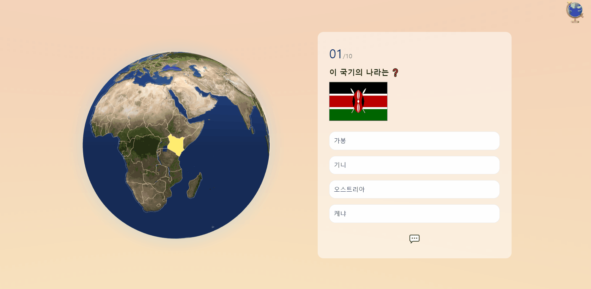
- 수도 맞추기 게임
  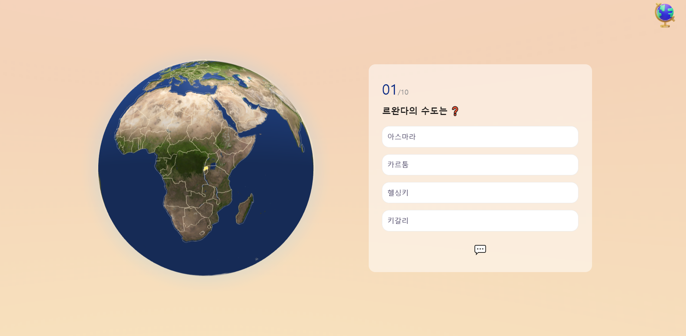

### 🗺️지도 상세 페이지

→ 지구본에서 국가 클릭 시 해당 국가의 2d 구글 맵 표시
 

- 히트맵으로 대략적인 치안수치 확인 가능
  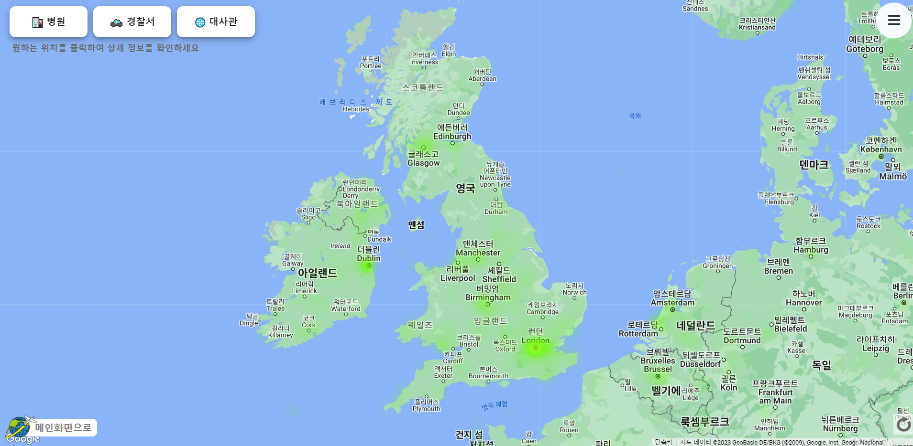
   
- 특정 수준까지 zoom in 시, 마커 핀 표시 + 사이드바에 해당 국가의 최신 기사 500개 보여줌
  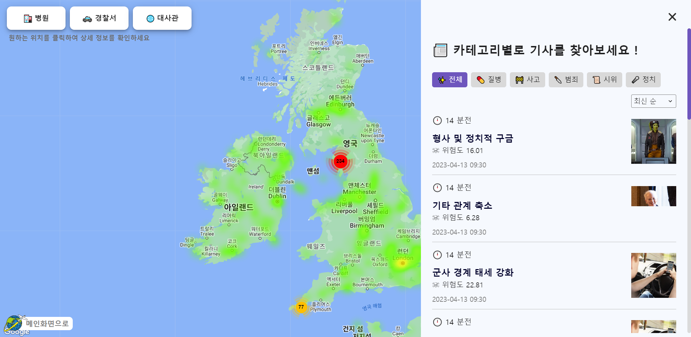
- 지도 내 특정 위치 클릭 후 좌측 상단의 토글 클릭 시 → 병원, 경찰서, 대사관 위치 확인 가능
  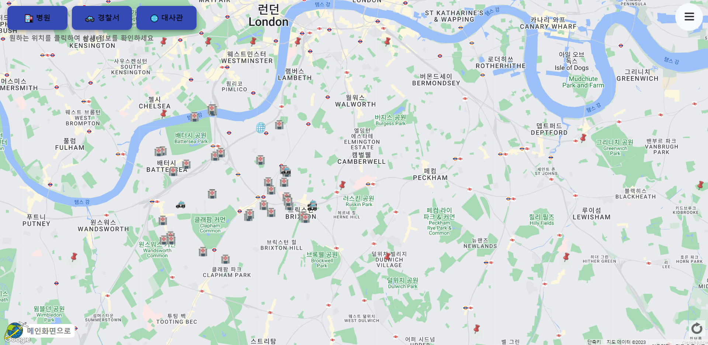

 

## 2️⃣ Mobile 화면 (반응형)

- 🌏 메인 화면

  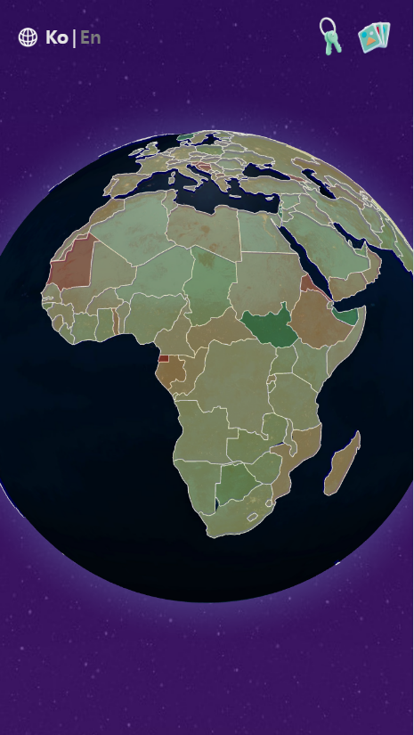 
  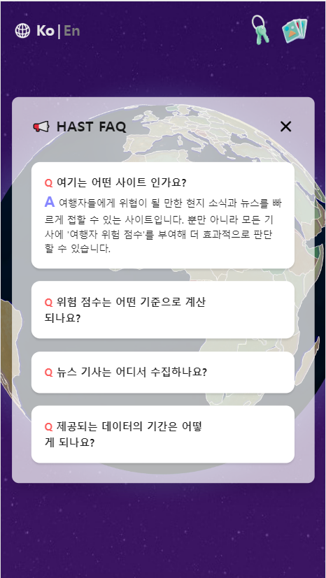
  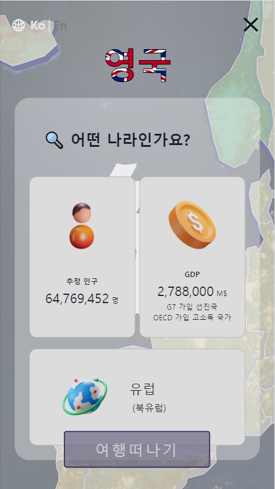

 

- 🎮 게임 화면

  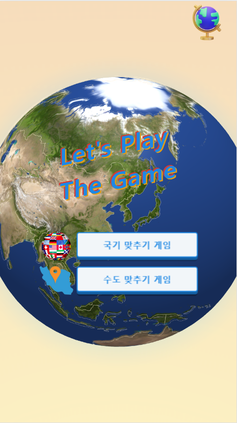
  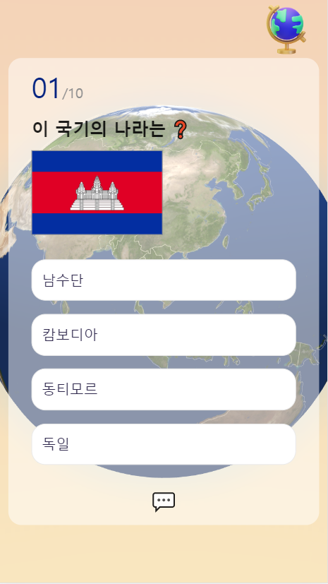
  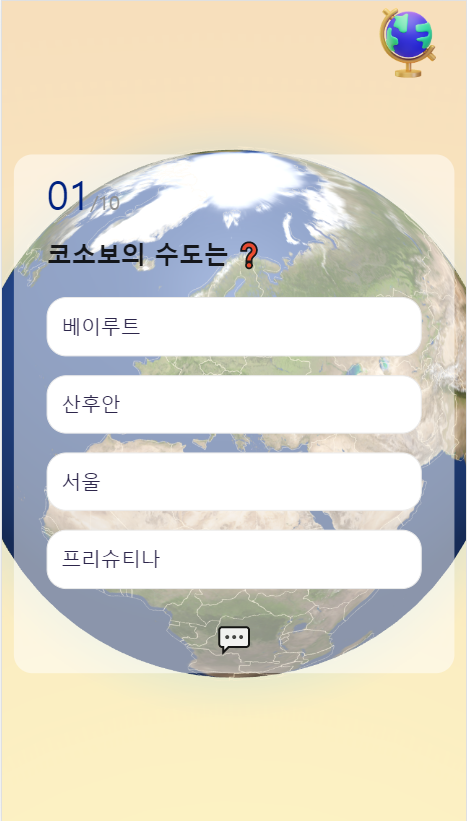

 

- 🗺️ 지도 상세 페이지

  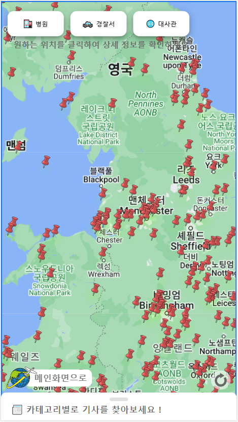
  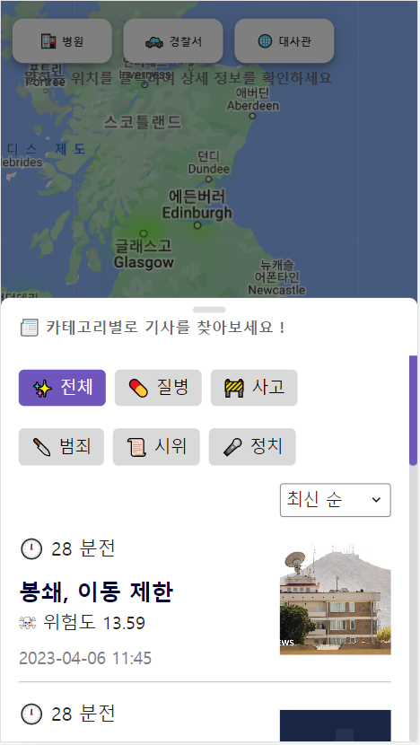
  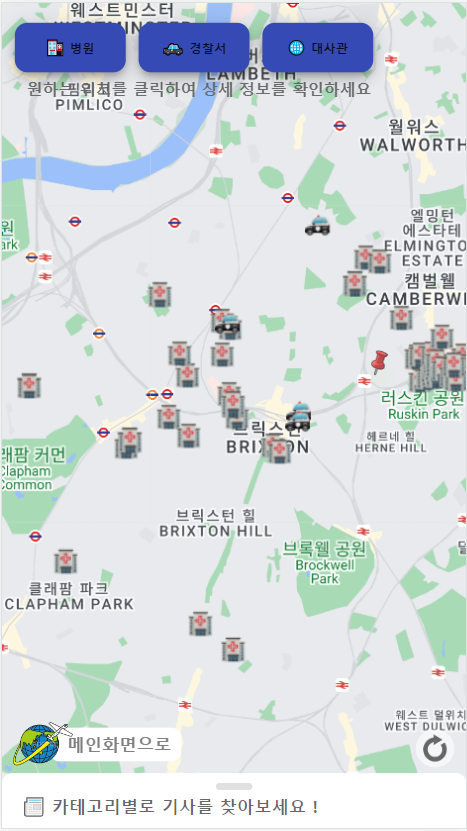

 

# 🎥 HAST UCC

👇 click ! 👇

<!--  -->
